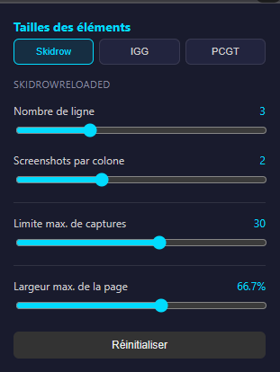
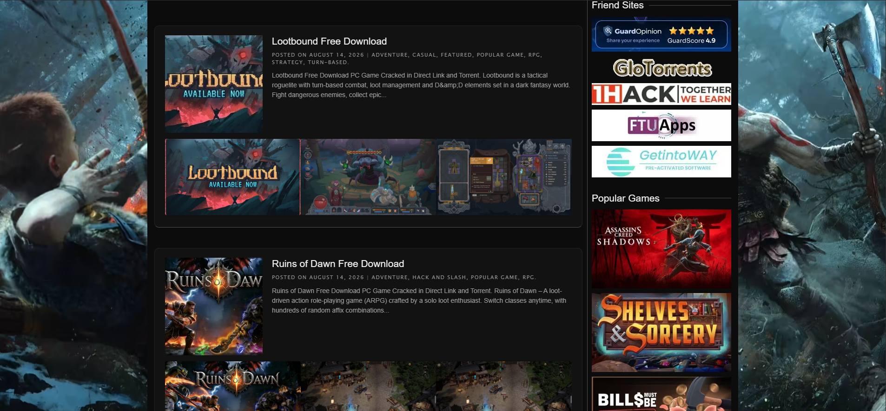
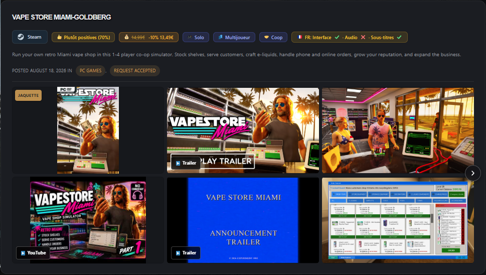

# Game Sites - Aperçu Screenshots

Extension pour navigateur permettant d'afficher directement les captures d'écran, vidéos/trailers, configurations requises, comparateur PC, taille des jeux et liens de téléchargement sur divers sites (SkidrowReloaded, IGG-Games, PCGamesTorrents) avec synchronisation Steam.

---

## 📥 Téléchargement

- ⚡ **[Télécharger directement l'extension (.ZIP)](https://github.com/Traycken/Crack-Game-Screenshots/archive/refs/heads/main.zip)** *(téléchargement direct instantané)*
- 📦 **[Voir la dernière version sur GitHub (Releases)](https://github.com/Traycken/Crack-Game-Screenshots/releases/latest)**

---

## 🚀 Installation manuelle sur Google Chrome

Suivez ces étapes pour installer l'extension en mode développeur sur Google Chrome (compatible également avec Brave, Edge, Opera, Vivaldi, etc.) :

### 1. Télécharger et extraire l'extension
1. Cliquez sur ce lien pour **[télécharger directement l'archive ZIP](https://github.com/Traycken/Crack-Game-Screenshots/archive/refs/heads/main.zip)** (ou rendez-vous sur le [dépôt GitHub](https://github.com/Traycken/Crack-Game-Screenshots)).
2. Décompressez l'archive ZIP dans un dossier permanent sur votre ordinateur (par exemple dans vos documents ou votre dossier de scripts).  
   > ⚠️ **Important :** Ne supprimez pas ce dossier après l'installation, Chrome en a besoin pour faire fonctionner l'extension.

---

### 2. Activer le mode développeur dans Chrome
1. Ouvrez Google Chrome.
2. Dans la barre d'adresse, tapez :
   ```text
   chrome://extensions/
   ```
   *(ou allez dans le menu `⋮` en haut à droite > **Extensions** > **Gérer les extensions**).*
3. En haut à droite de la page, activez l'interrupteur **Mode développeur**.

---

### 3. Charger l'extension
1. Cliquez sur le bouton **Charger l'extension non empaquetée** (*Load unpacked*) apparu en haut à gauche.
2. Dans la fenêtre de sélection de dossier, choisissez le dossier décompressé contenant le fichier `manifest.json`.
3. Validez : l'extension **Game Sites - Aperçu Screenshots** apparaît désormais dans votre liste d'extensions et est prête à l'emploi !

---

## 🔄 Mise à jour de l'extension

Pour mettre à jour l'extension manuellement lorsqu'une nouvelle version est disponible :
1. Téléchargez la dernière version depuis [GitHub](https://github.com/Traycken/Crack-Game-Screenshots).
2. Remplacez les anciens fichiers du dossier par les nouveaux.
3. Retournez sur `chrome://extensions/` et cliquez sur l'icône de **rafraîchissement** (🔄) sur la carte de l'extension.

---

## 🌟 Fonctionnalités

- 📸 **Captures d'écran & Vidéos** : Aperçu rapide des images et vidéos du jeu depuis la page d'accueil ou les listes.
- ⚙️ **Configurations requises & Comparateur PC** : Vérification rapide de la compatibilité avec votre matériel.
- 🎮 **Synchronisation Steam** : Intégration avec votre liste de souhaits et bibliothèque Steam.
- 🎛️ **Personnalisation** : Réglage de la taille des aperçus via la popup de l'extension.


## Screenshots

<div align="center">




